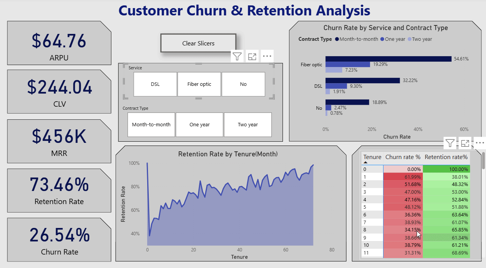

# Customer Churn & Retention Analysis



## Introduction

This project delivers a comprehensive **Customer Churn & Retention** analytics solution using **PostgreSQL** and **Power BI**. It ingests raw telecom-style data, builds SQL data models and views for key metrics (ARPU, MRR, CLV, Churn Rate, Retention Rate, Tenure retention), then visualizes them in an interactive Power BI dashboard with slicers, charts and a star schema model.

### Dashboard File
My final dashboard is in [Churn & Retention Analysis Dashboard](churn_analysis_dashboard.pbix).


## 🎯 Key business Questions & Answers

### 1. What is the average monthly churn rate?


The churn rate varies over time — it is higher in the early months (e.g., 61.99% in the 1st month) and decreases as customer tenure increases (e.g., 1.66% by the 72nd month).

### 2. Which segments by service type and contract show the highest churn?


From the view vw_churn_by_segment:

Customers on Month-to-Month + Fiber Optic plans have the highest churn rate — around 55%.

The lowest churn is seen in Two Year contracts with DSL/No Internet (< 5%).

#### Conclusion: 

Long-term contracts and basic/no internet significantly reduce churn risk.


### 3. How does customer retention change over time?


Customer retention improves significantly as tenure increases. New customers (tenure month 1) have a low retention rate of 38.01%, but this rises steadily, reaching 98.34% by month 72. This suggests that long-term customers are far more likely to stay each month. (Note: less than a month time frame shows 100% retention)


#### Conclusion:

The data reveals a clear pattern: retention rates increase with customer tenure. Early churn is high, but those who stay long-term exhibit strong loyalty, with retention rates exceeding 90% after 5 years. This suggests that efforts to retain customers past the initial months could yield a stable, loyal base.


### 4. What are the key financial metrics: ARPU, MRR, and CLV?

- ARPU (Average Revenue Per User) = $64.75
- MRR (Monthly Recurring Revenue) = ~ $456,000
- CLV (Customer Lifetime Value, projected) = $244 (Whole period)
- CLV (Customer Lifetime Value, projected) = $3901.20 (Last Month)


## 🛠 Skills & Tools Used

### 📂 Data Engineering
- **🐘 SQL / PostgreSQL**
  - DDL & schema design for fact/dimension tables  
  - Views for churn trend, retention by tenure, segment breakdown  
  - Aggregations, filtering
  - Table Validation

### 📊 Data Modeling & Visualization
- **📊 Power BI**
  - Star schema with active/inactive relationships  
  - Clustered Bar Chart, Line Chart, Matrix Heatmap, Cards  
  - Custom tooltips, slicers, cross-filter logic  

- **🎛️ UX / Interactivity**
  - Slicers for `InternetService`, `Contract`  
  - Cross-filtering & edit interactions for correct visual sync  
  - Conditional formatting (color scales for retention)

### 📐 Analytics Logic
- **🧮 DAX**
  - Core KPIs:  
    - `ChurnRate = Churned / Total`  
    - `RetentionRate = 1 - ChurnRate`  
    - `ARPU = Revenue / Active Users`  
    - `MRR`, `CLV = ARPU / ChurnRate`
  - Formatting: percentage & currency  
  - Calculated measures using `DIVIDE`, `CALCULATE`, `FORMAT`

### 📈 Retention & Cohort Insights
- Heatmap view by `tenure_month`  
- Line chart for churn trend  
- Matrix visual to show behavioral retention over lifecycle  


### AI Skills Used

- **🚀 Promt engineering**
- **🧠 Chain-of-Thought Prompting**
- **🛠️ AI-Assisted Formula & Code Generation**
- **🔍 Context Management**
- **🐞 Debugging Guidance**
- **🎨 Visualization Design**
- **🔄 Iterative Refinement**
- **📑 Technical Documentation**


###  Telco Customer Churn Dataset

The dataset used for this project is the **Telco Customer Churn** data from Kaggle, which contains real-world customer records and churn status for a U.S. telecom provider.

- **Source:**  
  [Telco Customer Churn Dataset on Kaggle](https://www.kaggle.com/blastchar/telco-customer-churn)

**Ingestion & Cleaning:**  
  - Imported as CSV via **Power Query** (handling nulls, type conversions)  
  - Loaded into PostgreSQL table `customers_raw` with `\COPY`  
  - Created lookup tables (`dim_internetservice`, `dim_contract`) and SQL views (`vw_churn_trend`, `vw_retention_by_tenure`, `vw_churn_by_segment`)


## 🛠 SQL Modeling & Queries

### 1. Schema & Dictionary Tables


```
CREATE TABLE customers_raw (
  CustomerID        VARCHAR(50),   
  Gender            VARCHAR(10),    
  SeniorCitizen     BOOLEAN,       
  Partner           VARCHAR(3),     
  Dependents        VARCHAR(3),     
  Tenure            INT,            
  PhoneService      VARCHAR(3),     
  MultipleLines     VARCHAR(20),    
  InternetService   VARCHAR(20),    
  OnlineSecurity    VARCHAR(3),     
  OnlineBackup      VARCHAR(3),     
  DeviceProtection  VARCHAR(3),     
  TechSupport       VARCHAR(3),     
  StreamingTV       VARCHAR(3),     
  StreamingMovies   VARCHAR(3),    
  Contract          VARCHAR(3),    
  PaperlessBilling  VARCHAR(3),     
  PaymentMethod     VARCHAR(50),    
  MonthlyCharges    DECIMAL(8,2),    
  TotalCharges      DECIMAL(10,2),   
  Churn             VARCHAR(3)      
);


ALTER TABLE customers_raw

ADD COLUMN IsChurn INT GENERATED ALWAYS AS (CASE WHEN Churn = 'Yes' THEN 1 ELSE 0 END) STORED;


-- Dimension: InternetService

CREATE TABLE Dim_InternetService AS
  SELECT DISTINCT InternetService
  FROM customers_raw
  WHERE InternetService IS NOT NULL;


-- Dimension: Contract

CREATE TABLE dim_contract AS
SELECT DISTINCT Contract
FROM customers_raw
WHERE Contract IS NOT NULL
  AND TRIM(Contract) <> '';

```

### Result via PostgreSQL


### 2. Core KPI Views

```
-- Churn analysis by tenure

CREATE VIEW vw_churn_trend AS

SELECT
  tenure AS tenure_month,
  COUNT(*) AS total_customers,
  SUM(ischurn) AS churned_customers,
  ROUND(SUM(ischurn)::numeric / COUNT(*)::numeric, 4) AS churn_rate
FROM customers_raw
GROUP BY tenure
ORDER BY tenure;


-- Churn rate by Internet Service and Contract type 

CREATE VIEW vw_churn_by_segment AS

SELECT
  InternetService,
  Contract,
  COUNT(*) AS customer_count,
  ROUND( AVG(MonthlyCharges), 2 ) AS avg_monthly_charge,
  ROUND( SUM(ischurn)::numeric / COUNT(*)::numeric, 4 ) AS churn_rate,
  SUM(IsChurn) AS ChurnedCustomers
FROM customers_raw
GROUP BY InternetService, Contract
ORDER BY churn_rate DESC;


--  Auxiliary View for Retention by Tenure

CREATE OR REPLACE VIEW vw_retention_by_tenure AS

SELECT
  Tenure AS tenure_month,
  COUNT(*) AS total_customers,
  SUM(CASE WHEN IsChurn = 0 THEN 1 ELSE 0 END) AS retained_customers,
  ROUND(SUM(CASE WHEN IsChurn = 0 THEN 1 ELSE 0 END)::numeric / COUNT(*)::numeric, 4) AS retention_rate
FROM customers_raw
GROUP BY Tenure
ORDER BY Tenure;

```
### Result via PostgreSQL


### 3. Sample Analytics Queries (Metrics)

```
-- ARPU (Average Revenue Per User)

SELECT ROUND(AVG(MonthlyCharges), 2) AS ARPU
FROM customers_raw;

-- MRR (Monthly Recurring Revenue)

SELECT ROUND(SUM(MonthlyCharges), 2)  AS MRR
FROM customers_raw;


-- CLV (Customer Lifetime Value) last month 


WITH cr AS (
	
  SELECT churn_rate
  FROM vw_churn_trend
  ORDER BY tenure_month DESC
  LIMIT 1
)
SELECT
  ROUND((SELECT AVG(MonthlyCharges) FROM customers_raw)::numeric(8,2)
  /
  (SELECT churn_rate FROM cr), 2) AS CLV;

```

### Result via PostgreSQL


## 📊 Power BI Dashboard

### 1. Star Schema Data Model


- Fact: customers_raw

- Lookup dims: dim_internetservice, dim_contract

- Views: vw_churn_trend, vw_retention_by_tenure, vw_churn_by_segment

### 2. Key DAX Measures


```
// Average revenue per user

ARPU = AVERAGE('public customers_raw'[MonthlyCharges])

// Monthly recurring revenue

MRR = SUM('public customers_raw'[MonthlyCharges])

// Churn Rate by tenure (latest)

ChurnRate = 
  DIVIDE(
    SUM('public vw_churn_trend'[churned_customers]),
    SUM('public vw_churn_trend'[total_customers]),
    0
  )

// Retention Rate

RetentionRate = 1 - [ChurnRate]

// Customer Lifetime Value (forecasted)

CLV = DIVIDE( [ARPU], [ChurnRate], 0 )
```


Formatting:

- ARPU, MRR, CLV → Currency ($)

- ChurnRate, RetentionRate → Percentage (1 decimal place)


## 📦 Conclusion

This Customer Churn Analysis dashboard was developed to model and visualize key retention and revenue metrics using real-world telecom‐style data. By leveraging PostgreSQL for data modeling and Power BI for interactive reporting, the project delivers insights into customer behavior over their service lifecycle.

Through this dashboard, stakeholders can:

- Monitor the monthly churn rate and identify critical drop-off points in the customer journey

- Analyze retention trends by tenure, highlighting when to intervene for maximum impact

- Compare churn across service types (InternetService) and contract plans to pinpoint high-risk segments

- Track financial
